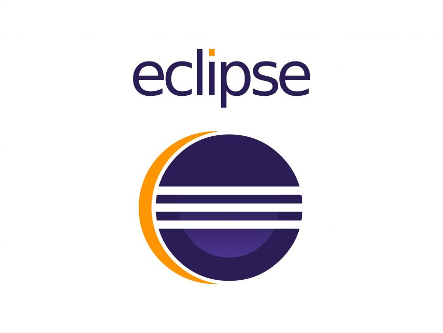

<h1 align="left">  Hi 👋 </h1>

###

My name is <b>Gangadhar</b> and I'm a <b>Computer Science</b> Graduate from <b>Government Autonomous College</b>,Rajahmundry,India  
      I am good at java programming language and also I have created some applications using frontend technologies such as  
      React, Javascript, Html, Css.  

###

<h2 align="left">About me</h2>

###

✨ Creating Web Applications  since 2023 📚 I'm currently learning Frontend Web Development 🎯 Goals: Software Developer Engineer 🎲 Fun fact: Love 2 Code

###

<h2 align="left">I code with</h2>

###

  
  
  
  
  
  
  
  
  
  
  
  
  
  

### Reach me at

  
  
  
  
  
  
  
  
  
  
  

## Few Facts

- 🔭 I’m currently pursuing my Bachelors from **[@ Government Autonomous College-India 🅾️](https://wexnermedical.osu.edu/)**
-   I enjoy working on
  - 📊 Frontend Web Development  & Java Programming.
  - 🖼 Computer Vision
- 📝 I write Simple code and Build small Websites.
- 👯 I’m looking to collaborate with someone who are also learning Frontend Technologies.
- 💬 Ask me about Java,Html, Css, React, MySql
- 📙 Check out my [Resume](https://www.linkedin.com/in/gangadhar-veeravalli-b108222a/)
- 🎉 Fun-Fact: I ❤️ Cricket and Movies🚀 and watch a lot Thriller Movies🎬

  
### 🖥️ My DevSetup

  
  
  
  
  
  
  

###
